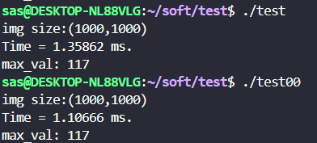
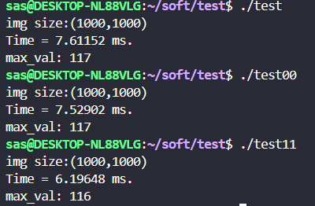
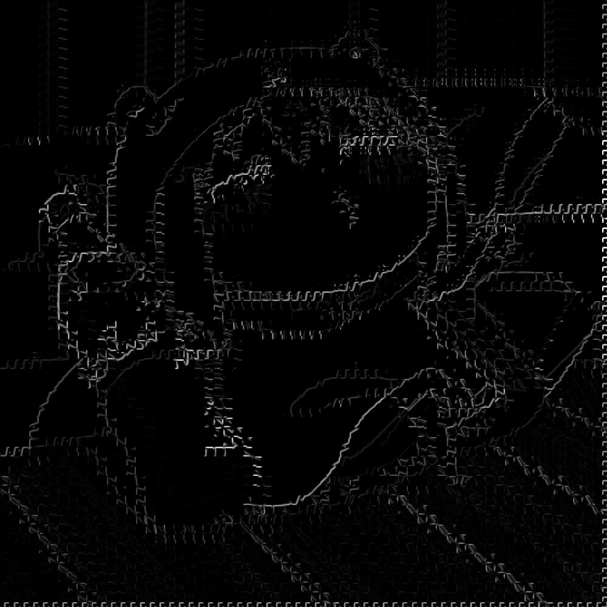
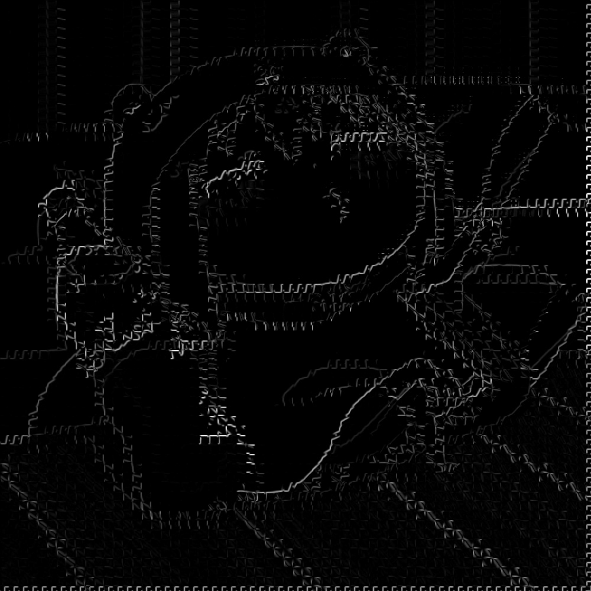
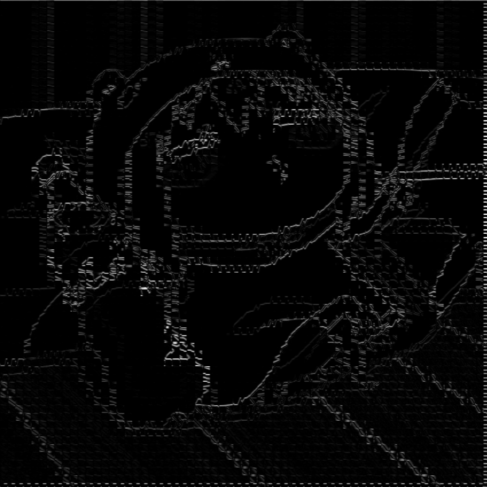

## 第一版优化---使用共享内存保存高斯核

~~~c++
针对gpu_convolution函数    
    //将高斯核取回到共享内存中
    __shared__ float mem_conv_kernel[MASK_WIDTH][MASK_WIDTH];
    int ker_row = threadIdx.y;
    int ker_col = threadIdx.x;
    if(ker_row < MASK_WIDTH && ker_col < MASK_WIDTH){
        mem_conv_kernel[ker_row][ker_col] = conv_kernel[ker_row*MASK_WIDTH + ker_col];
    }
~~~

用时测试函数

~~~c++
 //计算时间
    cudaEvent_t start, stop;
    cudaEventCreate(&start);
    cudaEventCreate(&stop);
    cudaEventRecord(start);
    cudaEventQuery(start);	

    // 得到xy方向梯度
    gpu_convolution<<<dimGrid,dimBlock>>>(dev_gray_img,dev_grad_x_img,conv_x_kernel,gray_img.cols,gray_img.rows);
    gpu_convolution<<<dimGrid,dimBlock>>>(dev_gray_img,dev_grad_y_img,conv_y_kernel,gray_img.cols,gray_img.rows);
    cudaDeviceSynchronize();
  

    cudaEventRecord(stop);
    cudaEventSynchronize(stop);
    float elapsed_time;
    cudaEventElapsedTime(&elapsed_time, start, stop);
    printf("Time = %g ms.\n", elapsed_time);
    cudaEventDestroy(start);
    cudaEventDestroy(stop);
~~~

 用时对比

## 第二版优化---将合并x，y合并到同一函数同时计算

用时测试函数

前两版

~~~c++
	//计算时间
    cudaEvent_t start, stop;
    cudaEventCreate(&start);
    cudaEventCreate(&stop);
    cudaEventRecord(start);
    cudaEventQuery(start);	

    // 得到xy方向梯度
    gpu_convolution<<<dimGrid,dimBlock>>>(dev_gray_img,dev_grad_x_img,conv_x_kernel,gray_img.cols,gray_img.rows);
    gpu_convolution<<<dimGrid,dimBlock>>>(dev_gray_img,dev_grad_y_img,conv_y_kernel,gray_img.cols,gray_img.rows);
    cudaDeviceSynchronize();
    gpu_merge_grid_xy<<<dimGrid,dimBlock>>>(dev_grad_x_img,dev_grad_y_img,dev_grad_xy,gray_img.cols,gray_img.rows);
    cudaDeviceSynchronize();

    cudaEventRecord(stop);
    cudaEventSynchronize(stop);
    float elapsed_time;
    cudaEventElapsedTime(&elapsed_time, start, stop);
    printf("Time = %g ms.\n", elapsed_time);
    cudaEventDestroy(start);
    cudaEventDestroy(stop);
~~~

后一版

~~~c++
//计算时间
    cudaEvent_t start, stop;
    cudaEventCreate(&start);
    cudaEventCreate(&stop);
    cudaEventRecord(start);
    cudaEventQuery(start);	

    // 得到xy方向梯度
    gpu_convolution<<<dimGrid,dimBlock>>>(dev_gray_img,dev_grad_xy,conv_x_kernel,conv_y_kernel,gray_img.cols,gray_img.rows);
    cudaDeviceSynchronize();

    cudaEventRecord(stop);
    cudaEventSynchronize(stop);
    float elapsed_time;
    cudaEventElapsedTime(&elapsed_time, start, stop);
    printf("Time = %g ms.\n", elapsed_time);
    cudaEventDestroy(start);
    cudaEventDestroy(stop);
~~~

合并后的函数

~~~c++
__global__ void gpu_convolution(uchar* src_img,uchar* output_img,float* conv_kernel_x,float* conv_kernel_y,int width,int height)
{
    __shared__ uchar mem_img_data[BLOCK_Y + MASK_WIDTH - 1][BLOCK_X + MASK_WIDTH - 1];
    
    //将高斯核取回到共享内存中
    __shared__ float mem_conv_kernel_x[MASK_WIDTH][MASK_WIDTH];
    __shared__ float mem_conv_kernel_y[MASK_WIDTH][MASK_WIDTH];
    int ker_row = threadIdx.y;
    int ker_col = threadIdx.x;
    if(ker_row < MASK_WIDTH && ker_col < MASK_WIDTH){
        mem_conv_kernel_x[ker_row][ker_col] = conv_kernel_y[ker_row*MASK_WIDTH + ker_col];
    }else if(ker_row>=MASK_WIDTH &&ker_row < MASK_WIDTH && ker_col < MASK_WIDTH){
        mem_conv_kernel_y[ker_row-MASK_WIDTH][ker_col] = conv_kernel_y[(ker_row-MASK_WIDTH)*MASK_WIDTH + ker_col];
    }
    __syncthreads();
    
    for(int h = 0;h < height;h += (gridDim.y * blockDim.y))
    {
        // copy data to shared mem

        int row = blockDim.y * blockIdx.y + threadIdx.y + h;
        int col = blockDim.x * blockIdx.x + threadIdx.x;

        int x_id = threadIdx.x;
        int y_id = threadIdx.y;

        int row_tmp;
        int col_tmp;

        if(y_id == 0)
        {
            if(x_id == 0)
            {
                // 左上角
                for(int i = 0;i < 4;i++)
                {
                    for(int j = 0;j < 4;j++)
                    {
                        row_tmp = row - 3 + i;
                        col_tmp = col - 3 + j;
                        if(row_tmp < 0 || row_tmp >= height || col_tmp < 0 || col_tmp >= width)
                        {
                            mem_img_data[i][j] = 0;
                        }else
                        {
                            mem_img_data[i][j] = src_img[row_tmp*width +col_tmp];
                        }
                    }   
                }
            }else if(x_id == BLOCK_X - 1)
            {
                // 右上角
                for(int i = 0;i < 4;i++)
                {
                    for(int j = 0;j < 4;j++)
                    {
                        row_tmp = row - 3 + i;
                        col_tmp = col + j;
                        if(row_tmp < 0 || row_tmp >= height || col_tmp < 0 || col_tmp >= width)
                        {
                            mem_img_data[i][x_id + 3 + j] = 0;
                        }else
                        {
                            mem_img_data[i][x_id + 3 + j] = src_img[row_tmp*width +col_tmp];
                        }
                    }   
                }
            }else
            {
                // 上面三个 + 本身
                for(int i = 0;i < 4;i++)
                {
                    row_tmp = row - 3 + i;
                    col_tmp = col;
                    if(row_tmp < 0 || row_tmp >= height || col_tmp < 0 || col_tmp >= width)
                    {
                        mem_img_data[i][x_id + 3] = 0;
                    }else
                    {
                        mem_img_data[i][x_id + 3] = src_img[row_tmp*width +col_tmp];
                    }
                }
            }
        }else if(y_id == BLOCK_Y - 1)
        {
            if(x_id == 0)
            {
                // 左下角
                for(int i = 0;i < 4;i++)
                {
                    for(int j = 0;j < 4;j++)
                    {
                        row_tmp = row + i;
                        col_tmp = col - 3 + j;
                        if(row_tmp < 0 || row_tmp >= height || col_tmp < 0 || col_tmp >= width)
                        {
                            mem_img_data[y_id + 3 + i][j] = 0;
                        }else
                        {
                            mem_img_data[y_id + 3 + i][j] = src_img[row_tmp*width +col_tmp];
                        }
                    }   
                }

            }else if(x_id == BLOCK_X - 1)
            {
                // 右下角
                for(int i = 0;i < 4;i++)
                {
                    for(int j = 0;j < 4;j++)
                    {
                        row_tmp = row + i;
                        col_tmp = col + j;
                        if(row_tmp < 0 || row_tmp >= height || col_tmp < 0 || col_tmp >= width)
                        {
                            mem_img_data[y_id + 3 + i][x_id + 3 + j] = 0;
                        }else
                        {
                            mem_img_data[y_id + 3 + i][x_id + 3 + j] = src_img[row_tmp*width +col_tmp];
                        }
                    }   
                }
            }else
            {
                // 下面三个
                for(int i = 0;i < 4;i++)
                {
                    row_tmp = row + i;
                    col_tmp = col;
                    if(row_tmp < 0 || row_tmp >= height || col_tmp < 0 || col_tmp >= width)
                    {
                        mem_img_data[y_id + 3 + i][x_id + 3] = 0;
                    }else
                    {
                        mem_img_data[y_id + 3 + i][x_id + 3] = src_img[row_tmp*width +col_tmp];
                    }
                }
            }
        }else if(x_id == 0)
        {
            // 左边三个
            for(int i = 0;i < 4;i++)
            {
                row_tmp = row;
                col_tmp = col - 3 + i;
                if(row_tmp < 0 || row_tmp >= height || col_tmp < 0 || col_tmp >= width)
                {
                    mem_img_data[y_id + 3][i] = 0;
                }else
                {
                    mem_img_data[y_id + 3][i] = src_img[row_tmp*width +col_tmp];
                }
            }

        }else if(x_id == BLOCK_X - 1)
        {
            // 右边三个
            for(int i = 0;i < 4;i++)
            {
                row_tmp = row;
                col_tmp = col + i;
                if(row_tmp < 0 || row_tmp >= height || col_tmp < 0 || col_tmp >= width)
                {
                    mem_img_data[y_id + 3][x_id + 3 + i] = 0;
                }else
                {
                    mem_img_data[y_id + 3][x_id + 3 + i] = src_img[row_tmp*width +col_tmp];
                }
            }
        }else
        {
            if(row < 0 || row >= height || col < 0 || col >= width)
            {
                mem_img_data[x_id + 3][y_id + 3] = 0;
            }else
            {
                mem_img_data[x_id + 3][y_id + 3] = src_img[row*width +col];
            }
        }

        __syncthreads();
        
        float sum_x = 0.0000f;
        float sum_y = 0.0000f;
        if(col < width && row < height)
        {
            for(int i = 0;i < MASK_WIDTH;i++)
            {
                for(int j = 0;j < MASK_WIDTH;j++)
                {
                    sum_x += mem_img_data[y_id + i][x_id + j] * mem_conv_kernel_x[i][j];
                    sum_y += mem_img_data[y_id + i][x_id + j] * mem_conv_kernel_y[i][j];
                }
            }
            output_img[width*row + col] =sqrt(pow(sum_x,2) + pow(sum_y,2));
        }
    }

}
~~~

三者用时比较：

输出图片比较：

